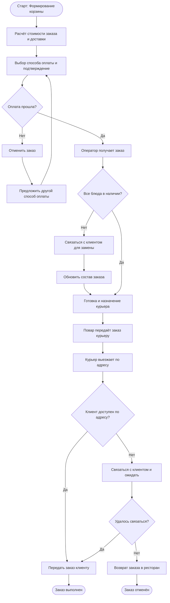

```mermaid
flowchart TD
    A([Старт: Формирование корзины]) --> B[Расчёт стоимости заказа и доставки]
    B --> C[Выбор способа оплаты и подтверждение]
    C --> D{Оплата прошла?}
    
    D -- Нет --> E[Отменить заказ]
    E --> F[Предложить другой способ оплаты]
    F --> C
    
    D -- Да --> G[Оператор получает заказ]
    G --> H{Все блюда в наличии?}
    
    H -- Нет --> I[Связаться с клиентом для замены]
    I --> J[Обновить состав заказа]
    J --> K[Готовка и назначение курьера]
    
    H -- Да --> K[Готовка и назначение курьера]
    
    K --> L[Повар передаёт заказ курьеру]
    L --> M[Курьер выезжает по адресу]
    M --> N{Клиент доступен по адресу?}
    
    N -- Да --> O[Передать заказ клиенту]
    O --> P([Заказ выполнен])
    
    N -- Нет --> Q[Связаться с клиентом и ожидать]
    Q --> R{Удалось связаться?}
    R -- Да --> O
    R -- Нет --> S[Возврат заказа в ресторан]
    S --> T([Заказ отменён])
```