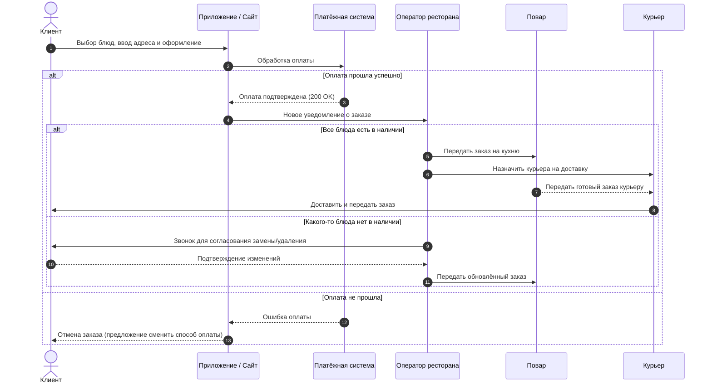

```mermaid
sequenceDiagram
    autonumber
    actor Client as Клиент
    participant App as Приложение / Сайт
    participant Pay as Платёжная система
    participant Operator as Оператор ресторана
    participant Cook as Повар
    participant Courier as Курьер

    Client->>App: Выбор блюд, ввод адреса и оформление
    App->>Pay: Обработка оплаты
    
    alt Оплата прошла успешно
        Pay-->>App: Оплата подтверждена (200 OK)
        App->>Operator: Новое уведомление о заказе
        
        alt Все блюда есть в наличии
            Operator->>Cook: Передать заказ на кухню
            Operator->>Courier: Назначить курьера на доставку
            Cook-->>Courier: Передать готовый заказ курьеру
            Courier->>Client: Доставить и передать заказ
        else Какого-то блюда нет в наличии
            Operator->>Client: Звонок для согласования замены/удаления
            Client-->>Operator: Подтверждение изменений
            Operator->>Cook: Передать обновлённый заказ
        end

    else Оплата не прошла
        Pay-->>App: Ошибка оплаты
        App-->>Client: Отмена заказа (предложение сменить способ оплаты)
    end
```